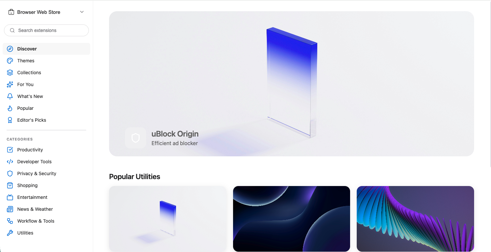

# OpenAddons WebStore

<div align="center">
  
  
  <p align="center">
    A modern, open-source addon store platform for developers and creators
  </p>
  
  
</div>

## Overview

OpenAddons WebStore is a full-stack platform designed to host, distribute, and manage addons, extensions, and plugins. Built with modern technologies, it provides a seamless experience for both developers publishing their work and users discovering new addons.

## Features

- **Modern UI/UX** - Clean, responsive interface built with React and TypeScript
- **Developer Dashboard** - Comprehensive tools for addon management and analytics
- **User Reviews & Ratings** - Community-driven feedback system
- **Version Management** - Support for multiple addon versions and update notifications
- **Search & Discovery** - Advanced filtering and categorization
- **Secure Distribution** - Safe addon hosting with automated security scanning
- **REST API** - Full API access for integration and automation
- **Open Source** - Transparent, community-driven development

## Tech Stack

### Frontend
- **TypeScript** - Type-safe JavaScript
- **React** - Component-based UI library
- **Modern tooling** - Vite/Webpack for optimal build performance

### Backend
- **Python** - Fast and reliable backend services
- **RESTful API** - Clean API architecture
- **Database** - Scalable data storage

## Getting Started

### Prerequisites

- Node.js 18+ and npm/yarn
- Python 3.10+
- pip for Python package management

### Installation

1. Clone the repository
```bash
git clone https://github.com/deep-neural/web-store.git
cd web-store
```

2. Install frontend dependencies
```bash
cd frontend
npm install
```

3. Install backend dependencies
```bash
cd backend
pip install -r requirements.txt
```

### Running Locally

#### Frontend
```bash
cd frontend
npm run dev
```

#### Backend
```bash
cd backend
python main.py
```

The frontend will be available at `http://localhost:5173` and the backend API at `http://localhost:8000`.

## Project Structure

```
openaddons-webstore/
├── frontend/          # React TypeScript application
│   ├── src/
│   ├── public/
│   └── package.json
├── backend/           # Python backend
│   ├── api/
│   ├── models/
│   ├── services/
│   └── requirements.txt
├── assets/            # Project assets
│   ├── logo.png
│   └── demo.png
└── README.md
```

## API Documentation

API documentation is available at `/api/docs` when running the backend server.

## Contributing

We welcome contributions from the community. Please read our contributing guidelines before submitting pull requests.

1. Fork the repository
2. Create your feature branch (`git checkout -b feature/amazing-feature`)
3. Commit your changes (`git commit -m 'Add amazing feature'`)
4. Push to the branch (`git push origin feature/amazing-feature`)
5. Open a Pull Request

## License

This project is licensed under the MIT License - see the LICENSE file for details.

## Support

For support, please open an issue in the GitHub repository or contact the maintainers.

## Roadmap

- [ ] Payment integration for premium addons
- [ ] Multi-language support
- [ ] Enhanced analytics dashboard
- [ ] Mobile applications
- [ ] WebSocket support for real-time updates

## Acknowledgments

Built with care by the open-source community.

---

<div align="center">
  Made with passion for the developer community
</div>